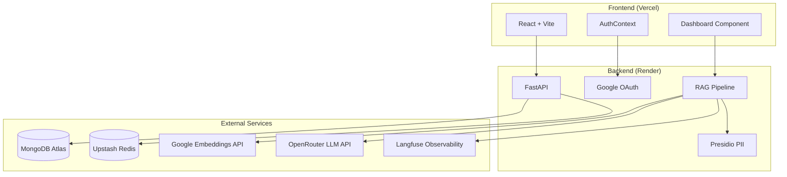
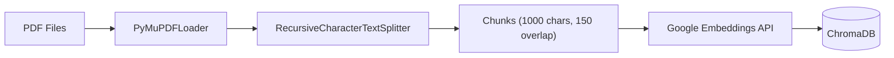
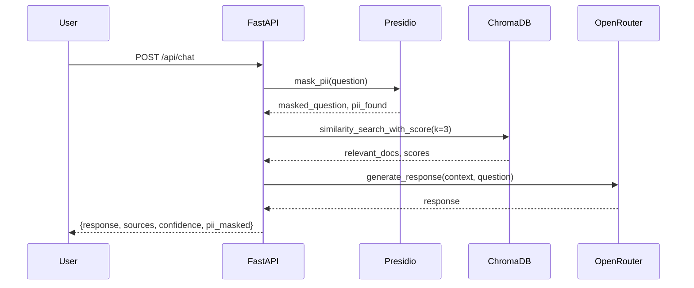

# 🛡️ Citizen Safety & Awareness AI - Technical Documentation

> **Developer**: Ambuj Kumar Tripathi  
> **Interview Ready**: January 29, 2026  
> **Architecture**: React + FastAPI + RAG + Multi-Cloud

---

## 📂 Project Structure

```
Citizen Safety Awareness AI/
├── backend/
│   ├── app/
│   │   ├── __init__.py
│   │   ├── main.py              # FastAPI app entry point
│   │   ├── config.py            # Pydantic settings management
│   │   ├── auth/
│   │   │   ├── routes.py        # Google OAuth endpoints
│   │   │   └── jwt.py           # JWT token creation/verification
│   │   ├── rag/
│   │   │   ├── pipeline.py      # Core RAG logic (embeddings, search, LLM)
│   │   │   └── routes.py        # Chat & upload API endpoints
│   │   └── db/
│   │       └── database.py      # MongoDB connection & CRUD
│   ├── data/                    # 8 Core PDF documents (permanent knowledge)
│   ├── chroma_db/               # Vector database (persistent)
│   ├── temp_uploads/            # User-uploaded PDFs (temporary)
│   ├── requirements.txt         # Python dependencies
│   └── .env                     # Environment variables (not in git)
│
└── frontend/
    └── src/
        ├── App.jsx              # React Router setup
        ├── main.jsx             # React entry point
        ├── index.css            # Global styles
        ├── components/
        │   ├── Dashboard.jsx    # Main chat interface
        │   ├── Chat.jsx         # Alternate chat component
        │   ├── Navbar.jsx       # Navigation bar
        │   └── Login.jsx        # Login page
        ├── context/
        │   └── AuthContext.jsx  # Auth state management
        ├── api/
        │   └── index.js         # Axios API client
        └── pages/
            └── AuthCallback.jsx # OAuth callback handler
```

---

## 🏗️ Architecture Overview



---

## 🔐 Authentication Flow

### Google OAuth 2.0 Implementation

| Step | Component | Description |
|------|-----------|-------------|
| 1 | `Login.jsx` | User clicks "Login with Google" |
| 2 | `auth/routes.py:login()` | Redirects to Google OAuth |
| 3 | Google | User authenticates |
| 4 | `auth/routes.py:auth_callback()` | Receives auth code, exchanges for token |
| 5 | `auth/jwt.py:create_access_token()` | Creates JWT with user info |
| 6 | Frontend | Stores JWT in localStorage |
| 7 | Every Request | JWT sent in Authorization header |

### OAuth Scope (Line 27 in `auth/routes.py`):
```python
client_kwargs={'scope': 'openid email profile'}
```
**Only accesses**: Name, Email, Profile Picture. **No Gmail inbox access.**

### JWT Token Structure:
```json
{
  "email": "user@gmail.com",
  "name": "User Name",
  "picture": "https://...",
  "exp": 1738123456
}
```

---

## 🧠 RAG Pipeline Deep Dive

### File: `backend/app/rag/pipeline.py` (472 lines)

### 1. Document Ingestion Flow



**Key Functions:**

| Function | Lines | Purpose |
|----------|-------|---------|
| `get_embeddings()` | 33-43 | Lazy-load Google Generative AI Embeddings |
| `rebuild_vector_db()` | 153-203 | Full re-index from `/data` folder |
| `add_documents_incremental()` | 206-252 | Add user uploads without touching core index |
| `clear_temporary_knowledge()` | 255-274 | Surgically delete only temp docs |

### 2. PII Masking (Microsoft Presidio)

```python
# Line 80-104
def mask_pii(text: str) -> tuple[str, bool, list]:
    # Uses spaCy en_core_web_sm model
    # Detects: PHONE_NUMBER, EMAIL_ADDRESS, PERSON, LOCATION
    # Custom Indian phone regex: (+91)?[6-9]\d{9}
```

**Custom Recognizer (Lines 65-74):**
```python
phone_pattern = Pattern(
    name="phone_number_regex",
    regex=r"(\+91[\-\s]?)?[6-9]\d{9}",  # Indian phone numbers
    score=0.5
)
```

### 3. Search & Response Flow



### 4. LLM Configuration (Lines 323-334)

```python
llm = ChatOpenAI(
    base_url="https://openrouter.ai/api/v1",
    api_key=settings.OPENROUTER_API_KEY,
    model="meta-llama/llama-3.3-70b-instruct:free",
    temperature=0.3,
    max_tokens=3000
)
```

### 5. Circuit Breaker Pattern (Lines 23-24, 357-364)

```python
llm_breaker = CircuitBreaker(fail_max=5, reset_timeout=30)

# Usage:
response = llm_breaker.call(chain.invoke, {...})
```
**Purpose**: If LLM fails 5 times → circuit opens → fast-fail for 30 seconds → auto-retry.

---

## 💾 Database Layer

### MongoDB Collections

| Collection | Purpose | TTL |
|------------|---------|-----|
| `chat_history` | User conversations | 30 days (GDPR) |
| `feedback` | 👍/👎 ratings | None |

### TTL Index for GDPR (Line 29 in `database.py`):
```python
_db["chat_history"].create_index("last_activity", expireAfterSeconds=2592000)  # 30 days
```

### Redis (Upstash) Usage

| Key | Purpose |
|-----|---------|
| `visitor_count` | Total website visits |
| `active_users` | Users active in last 15 mins |

---

## 🌐 API Endpoints

### Base URL: `https://citizen-safety-backend-mkbn.onrender.com`

| Method | Endpoint | Auth | Description |
|--------|----------|------|-------------|
| GET | `/` | ❌ | Welcome message |
| GET | `/health` | ❌ | Health check |
| GET | `/docs` | ❌ | Swagger UI |
| GET | `/auth/login` | ❌ | Start OAuth flow |
| GET | `/auth/callback` | ❌ | OAuth callback |
| POST | `/api/chat` | ✅ | Send message (rate limited: 10/min) |
| GET | `/api/history` | ✅ | Get chat history |
| POST | `/api/clear` | ✅ | Clear history |
| POST | `/api/upload` | ✅ | Upload PDFs |
| POST | `/api/rebuild-kb` | ✅ | Rebuild/reset knowledge base |
| GET | `/api/kb-status` | ❌ | Check KB status |
| GET | `/api/stats` | ❌ | Get visitor stats |
| POST | `/api/stats/increment` | ❌ | Increment visitor count |
| GET | `/api/stats/active` | ❌ | Get active users |
| POST | `/api/feedback` | ✅ | Submit feedback |

---

## 📊 Response Schema

```json
{
  "response": "### Digital Arrest Scam\n\nDigital arrest is...",
  "sources": [
    {
      "source_id": 1,
      "file": "DigitalArrest",
      "page": 3,
      "preview": "Digital arrest scam involves..."
    }
  ],
  "confidence": 87.5,
  "latency": 2.34,
  "pii_masked": true,
  "pii_entities": [
    {"type": "PHONE_NUMBER", "score": 0.85, "start": 10, "end": 20}
  ],
  "masked_question": "My number is <PHONE_NUMBER>, help me"
}
```

---

## 📚 Knowledge Base (8 Core PDFs)

| # | File | Topic | Pages |
|---|------|-------|-------|
| 1 | `ADVISORYTAU-ADV-003DigitalArrest06.03.2025.pdf` | Digital Arrest Scam Advisory | ~10 |
| 2 | `CARE AND PROTECTION OF CHILDREN) ACT, 2015.pdf` | POCSO Act | ~50 |
| 3 | `FraudsterssendingFakeJobOfferSMSstoperpetrateCybercrime.pdf` | Fake Job SMS Fraud | ~8 |
| 4 | `Ombudsman_Scheme_English.pdf` | Banking Ombudsman | ~20 |
| 5 | `RBIOS2021_amendments05082022.pdf` | RBI Amendments | ~15 |
| 6 | `RBI_English BEAWARE.pdf` | RBI Fraud Awareness | ~30 |
| 7 | `posh handbook.pdf` | POSH (Sexual Harassment) Act | ~100 |
| 8 | `Ambuj_Kumar_Tripathi_GENAI_Resume.pdf` | Developer Resume | 2 |

---

## 🎨 Frontend Features

### Dashboard.jsx (787 lines)

| Feature | Lines | Description |
|---------|-------|-------------|
| Toast System | 32-37 | Custom notifications |
| Message Display | 490-620 | Markdown rendering with ReactMarkdown |
| Source Citations | 518-564 | Expandable source badges |
| PII Audit Modal | 718-781 | View Presidio detection log |
| File Upload | 161-168 | PDF drag & drop |
| Incremental Index | 170-192 | "Sync Brain" button |
| Surgical Clear | 194-208 | "Reset Context Brain" button |
| Quick Actions | 211-219 | Pre-defined prompts |
| Tech Stack Dropdown | 221-233 | Show technologies used |
| Live Active Users | 74-81 | Real-time from Redis |

---

## ⚙️ Environment Variables

### Backend (.env)

| Variable | Purpose |
|----------|---------|
| `GOOGLE_CLIENT_ID` | OAuth Client ID |
| `GOOGLE_CLIENT_SECRET` | OAuth Secret |
| `GOOGLE_REDIRECT_URI` | OAuth callback URL |
| `FRONTEND_URL` | Vercel frontend URL |
| `SECRET_KEY` | JWT signing key |
| `OPENROUTER_API_KEY` | LLM API key |
| `GOOGLE_API_KEY` | Embeddings API key |
| `MONGO_URI` | MongoDB Atlas connection |
| `UPSTASH_REDIS_REST_URL` | Redis URL |
| `UPSTASH_REDIS_REST_TOKEN` | Redis token |
| `LANGFUSE_*` | Observability keys |

### Frontend (.env)

| Variable | Purpose |
|----------|---------|
| `VITE_API_URL` | Backend API base URL |

---

## 🚀 Deployment Architecture

| Service | Platform | URL |
|---------|----------|-----|
| Frontend | Vercel | https://citizen-safety-ai-assistant.vercel.app |
| Backend | Render (Free) | https://citizen-safety-backend-mkbn.onrender.com |
| Database | MongoDB Atlas | Cloud cluster |
| Cache | Upstash Redis | Serverless Redis |
| LLM | OpenRouter | Llama 3.3 70B |
| Embeddings | Google AI | embedding-001 |
| Monitoring | Langfuse | LLM observability |

---

## 🛡️ Security Features

| Feature | Implementation |
|---------|----------------|
| **PII Masking** | Microsoft Presidio + spaCy en_core_web_sm |
| **Rate Limiting** | SlowAPI: 10 requests/minute per user |
| **JWT Authentication** | HS256 signed tokens, 24hr expiry |
| **CORS** | Whitelist: localhost, Vercel URL |
| **Circuit Breaker** | pybreaker: 5 failures → 30s cooldown |
| **GDPR Compliance** | MongoDB TTL: 30-day auto-delete |
| **Input Validation** | Pydantic models with Field constraints |
| **Abusive Language Filter** | Keyword blocklist |

---

## 📈 Memory Optimization

| Optimization | Savings |
|--------------|---------|
| Google API Embeddings (vs HuggingFace local) | ~300MB RAM saved |
| spaCy en_core_web_sm (vs en_core_web_lg) | ~700MB RAM saved |
| Lazy imports inside functions | Faster cold start |
| Global singleton pattern | No duplicate instances |

**Estimated Usage**: 250-400 MB (within Render 512MB limit)

---

## 🧪 Interview Talking Points

### "Walk me through the RAG pipeline"
1. User submits question → PII masked by Presidio
2. Question embedded via Google Generative AI
3. ChromaDB similarity search (k=3) → returns relevant chunks
4. Context + question sent to Llama 3.3 70B via OpenRouter
5. Response includes sources with page numbers
6. Confidence score calculated from vector distance

### "How do you handle security?"
1. **Authentication**: Google OAuth 2.0 → JWT tokens
2. **PII Protection**: Microsoft Presidio real-time masking
3. **Rate Limiting**: SlowAPI prevents abuse
4. **GDPR**: MongoDB TTL auto-deletes after 30 days
5. **Circuit Breaker**: Prevents cascading LLM failures

### "Explain incremental indexing"
- Core 8 PDFs = permanent index (never deleted)
- User uploads tagged with `is_temporary: True` metadata
- "Reset Brain" calls `clear_temporary_knowledge()` 
- Uses ChromaDB `delete(where={"is_temporary": True})`
- No re-indexing of core docs needed

### "Why these tech choices?"
- **FastAPI**: Async, automatic OpenAPI docs, Pydantic validation
- **ChromaDB**: Simple, no external server, persistent
- **Google Embeddings**: Free tier generous, low latency
- **OpenRouter**: Access to multiple LLMs, free tier
- **Render**: Easy Python deployment, auto-scaling

---

## ✅ Final Deployment Checklist

- [x] `GOOGLE_API_KEY` added to config.py and Render
- [x] `Chroma` import added at top-level (line 16)
- [x] `PyMuPDFLoader` & `RecursiveCharacterTextSplitter` imports in `add_documents_incremental()`
- [x] All lazy imports verified inside functions
- [x] Frontend VITE_API_URL points to Render URL
- [x] Vercel rewrites configured for SPA routing
- [x] CORS includes Vercel domain

---

**Document Created**: January 29, 2026 | **Version**: 1.0 | **Status**: READY FOR INTERVIEW 🚀
